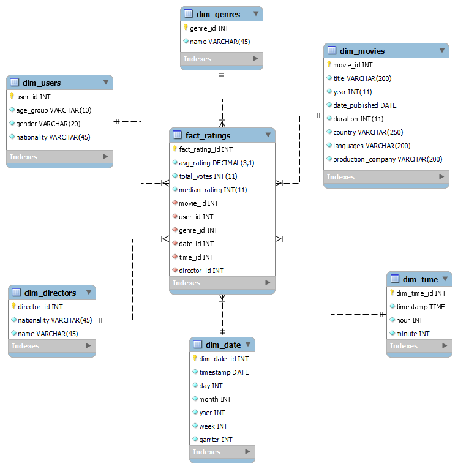
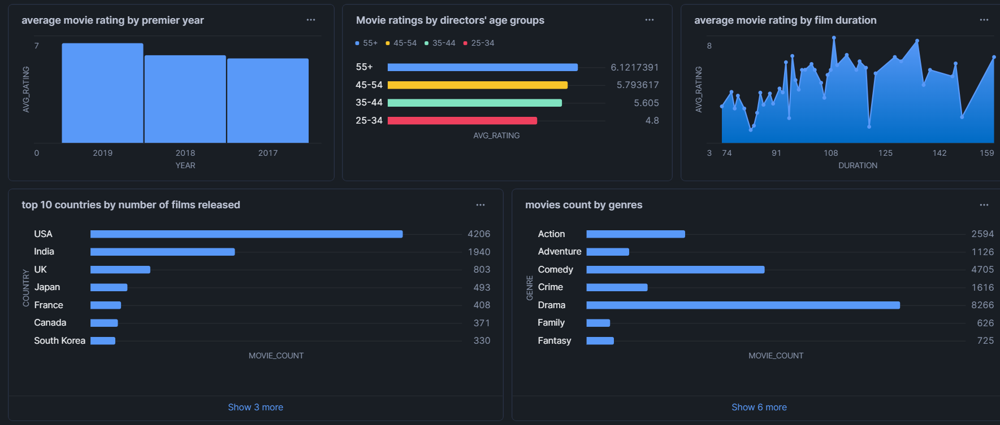

# ETL proces IMDB 
---
## **1. Úvod a popis zdrojových dát**
Zdrojova databáza IMDB obsahuje nasledujúce tabuľky:
- **`movie`**:
- **`ratings`**:
- **`genre`**:
- **`names`**:
- **`role_mapping`**:
- **`direcor_mappint`**:

### **ERD diagram**

  
   
  <em>Obrázok 1 ERD IMDB</em>

---
## **2. Návrh dimenzionálneho modelu**
star_schema bol vytvorený na pohodlnú analýzu a vizualizáciu údajov. Hlavnou tabuľkou je tabuľka fact_ratings. Je prepojená s nasledujúcimi tabuľkami dimenzií:
- **`dim_movies`**:
- **`dim_directors`**:
- **`dim_actors`**:
- **`dim_date`**:

  
   
  <em>Obrázok 2 Star schema IMDB</em>

---
## **3. ETL proces v nástroji Snowflake**
ETL proces ma tri kľúčové fázy: extrakciu (Extract), transformáciu (Transform) a nahrávanie (Load). Tento proces bol realizovaný v Snowflake s cieľom spracovať zdrojové dáta zo staging vrstvy do podoby viacdimenzionálneho modelu, ktorý je vhodný na analýzu a vizualizáciu.

---
## **4. Vizualizácia dát**

  
   
  <em>Obrázok 3 Dashboard IMDB</em>

---
**Autor:** Ivan ALisov
