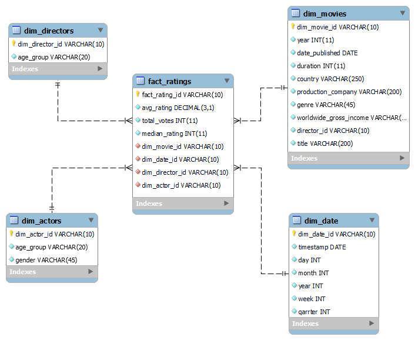

# ETL proces IMDB 
---
## **1. Úvod a popis zdrojových dát**
Zdrojové údaje obsahujú informácie o filmoch (žánre, jazyky, dĺžka trvania, dátum a krajina vydania atď.), hodnotenia filmov, informácie o hercoch a režiséroch filmov. 
Cieľom projektu je sformátovať údaje na jednoduchú analýzu a vizualizáciu údajov pomocou procesov ETL.
Databáza IMDB obsahuje nasledujúce tabuľky:
- **`movie`**
- **`ratings`**
- **`genre`**
- **`names`**
- **`role_mapping`**
- **`direcor_mapping`**

### **ERD diagram**
<p align="center">
  
  <br>
  <em>Obrázok 1 ERD IMDB</em>
</p>

---
## **2. Návrh dimenzionálneho modelu**
Star schema bola vytvorena na jednoduchu analýzu a vizualizáciu údajov. Hlavnou tabuľkou je tabuľka **`fact_ratings`**. Krora je prepojená s nasledujúcimi tabuľkami dimenzií:
- **`dim_movies`** - obsahuje podrobné informácie o filmoch (dátum vydania, krajina, žánre, zisk, id režiséra atď.)
- **`dim_directors`** - obsahuje všeobecné informácie o režiséroch (veková skupina, meno)
- **`dim_actors`** - informácie o hercoch (vek, pohlavie, výška)
- **`dim_date`** - podrobné informácie o dátumoch hodnotených filmov (deň, mesiac, rok, týždeň, štvrťrok)

<p align="center">
  
  <br>
  <em>Obrázok 2 Star schema IMDB</em>
</p>


---
## **3. ETL proces v nástroji Snowflake**
ETL proces ma tri kľúčové fázy: **`extrakciu`** (Extract), **`transformáciu`** (Transform) a **`nahrávanie`** (Load). Tento proces bol realizovaný v Snowflake s cieľom spracovať zdrojové dáta zo staging vrstvy do podoby dimenzionálneho modelu, ktorý je vhodný na analýzu a vizualizáciu.
### **3.1 Extract**
Zdrojové dáta vo formáte .csv boli najprv uložené do Snowflake cez interné úložisko typu stage s názvom **`IMDB_STAGE`**. Toto úložisko slúži ako medzistupeň na prenos dát pri importe alebo exporte. Proces vytvorenia stage bol realizovaný pomocou príkazu:
```sql
CREATE OR REPLACE STAGE IMDB_STAGE;
```
---
Pre nahranie dát z každej tabuľky do staging tabuliek bol využitý príkaz COPY INTO:
```sql
COPY INTO genre_stage
FROM @IMDB_STAGE/genre.csv
FILE_FORMAT = (TYPE = 'CSV' FIELD_OPTIONALLY_ENCLOSED_BY = '"' SKIP_HEADER = 1);
```
---
Pri importovaní do tabuľky **``movie_stage``** došlo k chybe **``Found character 'T' instead of record delimiter '\n'``**.

Preto som musel použiť doplnkové parametre:
```sql
COPY INTO movie_stage
FROM @IMDB_STAGE/movie.csv
FILE_FORMAT = ( TYPE = 'CSV' FIELD_OPTIONALLY_ENCLOSED_BY = '"'SKIP_HEADER = 1
    RECORD_DELIMITER = '\n'  
    FIELD_DELIMITER = ','   
)
ON_ERROR = 'CONTINUE';
```
---


### **3.2 Transform**
V tejto fáze prešli dáta zo staging tabuliek procesom čistenia, transformácie a obohatenia. Hlavným cieľom bolo vytvoriť dimenzie a faktovú tabuľku, ktoré zabezpečia jednoduchú a efektívnu analýzu.

Tabulky **``dim_actors``** a **``dim_directors``** obsahujú informácie o hercoch a režiséroch. Logika definovania vekovej skupiny je rovnaká. V **``dim_actors``** je aj stĺpec ``gender`` ktorý je definovaný pomocou hodnot ``actor`` and ``actress`` z tabulky **``role_mapping_stage``**. SCD: Typ 1, pretože tabuľky obsahuju aktuálne informácie o režisérovi a hiercah (napr. pohlavie, veková skupina na základe dátumu narodenia).
```sql
CREATE TABLE dim_actors AS
SELECT DISTINCT 
    n.id as dim_actor_id,
    CASE 
        WHEN r.category = 'actress' THEN 'female'
        WHEN r.category = 'actor' THEN 'male'
        ELSE 'Unknown'
    END AS gender,
    CASE 
        WHEN DATEDIFF(YEAR, n.date_of_birth, CURRENT_DATE) < 18 THEN 'Under 18'
        WHEN DATEDIFF(YEAR, n.date_of_birth, CURRENT_DATE) BETWEEN 18 AND 24 THEN '18-24'
        WHEN DATEDIFF(YEAR, n.date_of_birth, CURRENT_DATE) BETWEEN 25 AND 34 THEN '25-34'
        WHEN DATEDIFF(YEAR, n.date_of_birth, CURRENT_DATE) BETWEEN 35 AND 44 THEN '35-44'
        WHEN DATEDIFF(YEAR, n.date_of_birth, CURRENT_DATE) BETWEEN 45 AND 54 THEN '45-54'
        WHEN DATEDIFF(YEAR, n.date_of_birth, CURRENT_DATE) >= 55 THEN '55+'
        ELSE 'Unknown'
    END AS age_group,
    FROM names_stage n
    JOIN role_mapping_stage r ON r.name_id = n.id;
```
---
Tabuľka **``dim_date``** je vytvorená z stlpca ``date_published`` v tabulke **``movie_stage``** na ukladanie údajov o dátume vydania hodnoteného filmu - ``day``, ``week``, ``month``, **``quarter``**, ``year``. Stĺpec ``month`` bol prevedený na reťazcový názov mesiaca kontrolou hodnoty čísla mesiaca v dátume. Typ SCD: Typ 1. Tu pravdepodobne nedôjde k žiadnej zmene, pretože každý dátum je jedinečný a v budúcnosti sa nebude meniť.
```sql
CREATE TABLE dim_date AS
SELECT
    ROW_NUMBER() OVER (ORDER BY date_published) AS dim_date_id,
    date_published as date,
    DATE_PART(day, date_published) AS day,             
    DATE_PART(week, date_published) AS week,          
    CASE DATE_PART(month, date_published)
        WHEN 1 THEN 'January'
        WHEN 2 THEN 'February'
        WHEN 3 THEN 'March'
        WHEN 4 THEN 'April'
        WHEN 5 THEN 'May'
        WHEN 6 THEN 'June'
        WHEN 7 THEN 'July'
        WHEN 8 THEN 'August'
        WHEN 9 THEN 'September'
        WHEN 10 THEN 'Oktober'
        WHEN 11 THEN 'November'
        WHEN 12 THEN 'December'
    END AS month,             
    DATE_PART(quarter, date_published) AS quarter,     
    DATE_PART(year, date_published) AS year            
FROM
    (SELECT DISTINCT date_published FROM movie_stage) t 
WHERE
    date_published IS NOT NULL;         
```
---
Tabuľka **``dim_movies``** bola vytvorená podobne jednoducho na základe tabuľky **``movie_stage``**, uchováva zdrojove údaje o filme. Pomocou tabuľky **``director_mapping_stage``** bol pridaný aj stĺpec ``director_id`` na uloženie id režiséra. Filmové žánre boli zapísané oddelené čiarkou pri pomocou **``LISTAGG``**, prevzaté z tabuľky **``genre_stage``**. SCD: Typ 1. Pravdepodobne, ak sa informácie o filme zmenia - jednoducho sa aktualizuje existujúci záznam bez zachovania histórie zmien.
```sql
LISTAGG(g.genre, ', ') WITHIN GROUP (ORDER BY g.genre) AS dim_genres, -- split genres with commas  
```
---
Faktová tabuľka **``fact_ratings``** obsahuje záznamy o hodnoteniach a prepojenia na všetky dimenzie. Obsahuje kľúčové metriky, ako je hodnota hodnotenia, celkový počet hlasov, mediánové hodnotenie.
```sql
CREATE TABLE dim_actors AS
SELECT DISTINCT 
    n.id as dim_actor_id,
    CASE 
        WHEN r.category = 'actress' THEN 'female'
        WHEN r.category = 'actor' THEN 'male'
        ELSE 'Unknown'
    END AS gender,
    CASE 
        WHEN DATEDIFF(YEAR, n.date_of_birth, CURRENT_DATE) < 18 THEN 'Under 18'
        WHEN DATEDIFF(YEAR, n.date_of_birth, CURRENT_DATE) BETWEEN 18 AND 24 THEN '18-24'
        WHEN DATEDIFF(YEAR, n.date_of_birth, CURRENT_DATE) BETWEEN 25 AND 34 THEN '25-34'
        WHEN DATEDIFF(YEAR, n.date_of_birth, CURRENT_DATE) BETWEEN 35 AND 44 THEN '35-44'
        WHEN DATEDIFF(YEAR, n.date_of_birth, CURRENT_DATE) BETWEEN 45 AND 54 THEN '45-54'
        WHEN DATEDIFF(YEAR, n.date_of_birth, CURRENT_DATE) >= 55 THEN '55+'
        ELSE 'Unknown'
    END AS age_group,
    FROM names_stage n
    JOIN role_mapping_stage r ON r.name_id = n.id;
```
---


### **3.3 Load**
Po vytvorení dimenzií a faktovej tabuľky boli dáta uložené do finálnej štruktúry. Staging tabuľky boli následne odstránené na optimalizáciu úložiska.
```sql
DROP TABLE IF EXISTS ratings_stage;
DROP TABLE IF EXISTS names_stage;
DROP TABLE IF EXISTS role_mapping_stage;
DROP TABLE IF EXISTS director_mapping_stage;
DROP TABLE IF EXISTS genre_stage;
DROP TABLE IF EXISTS movie_stage
```
ETL proces v Snowflake spracoval pôvodné dáta z formátu .csv do viacdimenzionálneho modelu typu hviezda. Tento proces zahŕňal čistenie, obohacovanie a reorganizáciu dát. Výsledný model umožňuje analýzu preferencií a správania používateľov a slúži ako základ pre vizualizácie a reporty.


---
## **4. Vizualizácia dát**
<p align="center">
  
  <br>
  <em>Obrázok 3 Dashboard IMDB</em>
</p>

---
### **Graf 1: Priemerné hodnotenie filmu podľa roku premiéry**
Umožňuje porovnať priemerné hodnotenie filmov podľa roku vydania.
```sql
SELECT 
    dm.dim_year, 
    AVG(fr.avg_rating) AS avg_rating
FROM fact_ratings fr
JOIN dim_movies dm ON dm.dim_movie_id = fr.movie_id
GROUP BY dm.dim_year
ORDER BY dm.dim_year;
```
---
### **Graf 2: Priemerné hodnotenie filmu podľa dĺžky trvania filmu**
Dáva možnosť zistiť, ktoré dĺžky filmov získajú najvyššie hodnotenie.
```sql
SELECT 
    dm.duration AS duration, 
    AVG(fr.avg_rating) AS avg_rating
FROM fact_ratings fr
JOIN dim_movies dm ON dm.dim_movie_id = fr.movie_id
GROUP BY dm.duration
ORDER BY dm.duration;
```
---
### **Graf 3: Hodnotenia filmov podľa vekových skupín režisérov**
Porovnanie hodnotenia filmov podľa vekových skupín režisérov. Napríklad, aby sme zistili, ktorí režiséri sú talentovanejší.
```sql
SELECT 
    d.age_group, 
    AVG(fr.avg_rating) AS avg_rating
FROM fact_ratings fr
JOIN dim_directors d ON d.dim_director_id = fr.director_id
WHERE d.age_group != 'Unknown' 
GROUP BY d.age_group
ORDER BY d.age_group;
```
---
### **Graf 4: Počet filmov podľa žánrov**
Štatistika, ktorá zobrazuje počet filmov natočených v rôznych žánroch.
```sql
SELECT 
    TRIM(genre_split.value) AS genre,
    COUNT(*) AS movie_count
FROM 
    dim_movies dm,
    LATERAL FLATTEN(input => SPLIT(dm.dim_genres, ', ')) AS genre_split
GROUP BY 
    genre_split.value
ORDER BY 
    movie_count DESC;
```
---
### **Graf 5: Top 10 krajín podľa počtu vydaných filmov**
Všeobecná štatistika, ktorá vám umožní zistiť, v ktorých krajinách bolo vydaných najviac filmov.
```sql
SELECT 
    dm.country, 
    COUNT(*) AS movie_count
FROM dim_movies dm
GROUP BY dm.country
ORDER BY movie_count DESC
LIMIT 10;
```
---


**Autor:** Ivan ALisov
